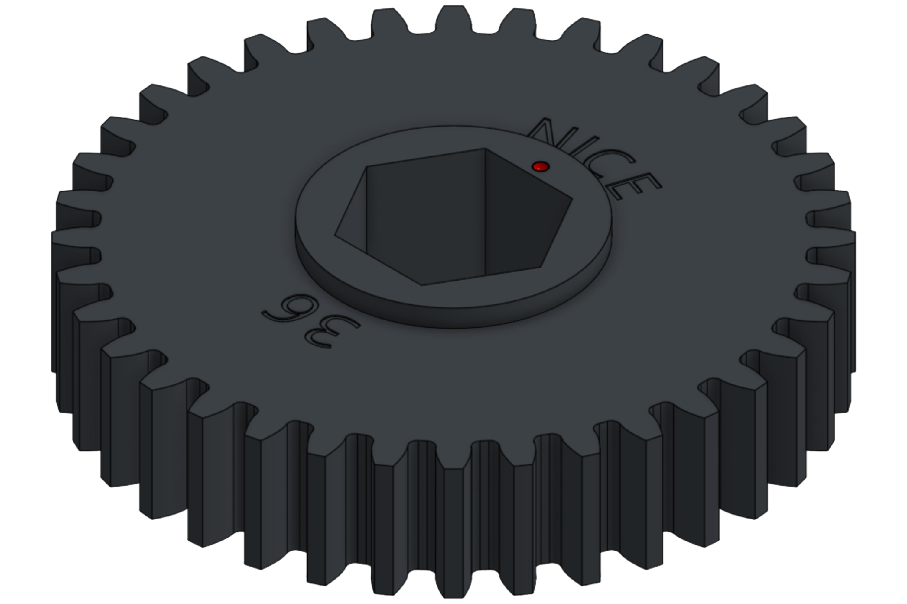
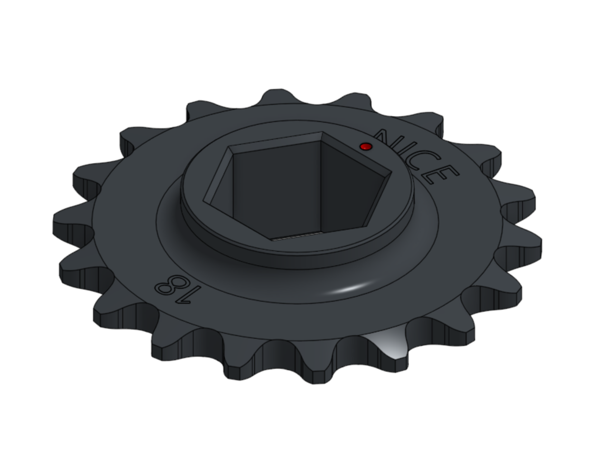
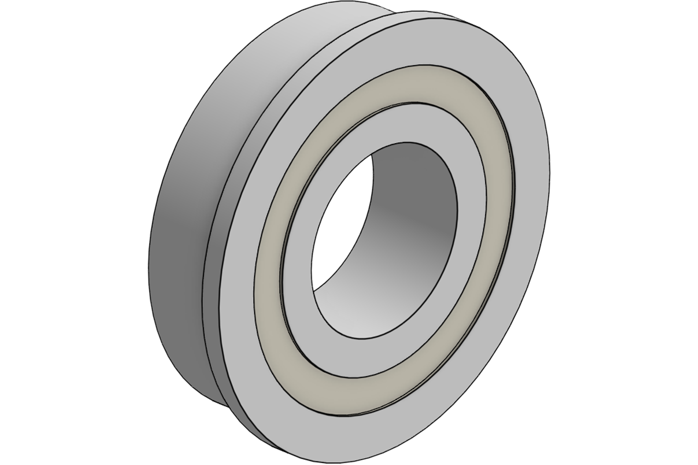
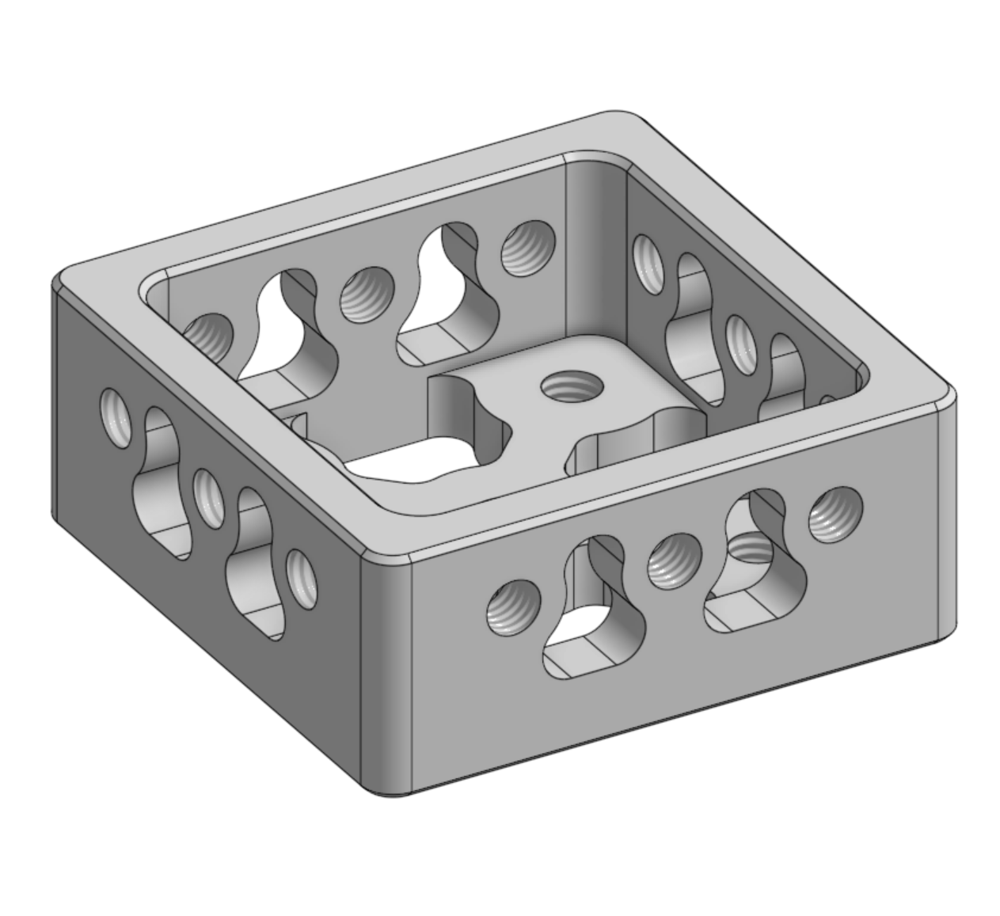
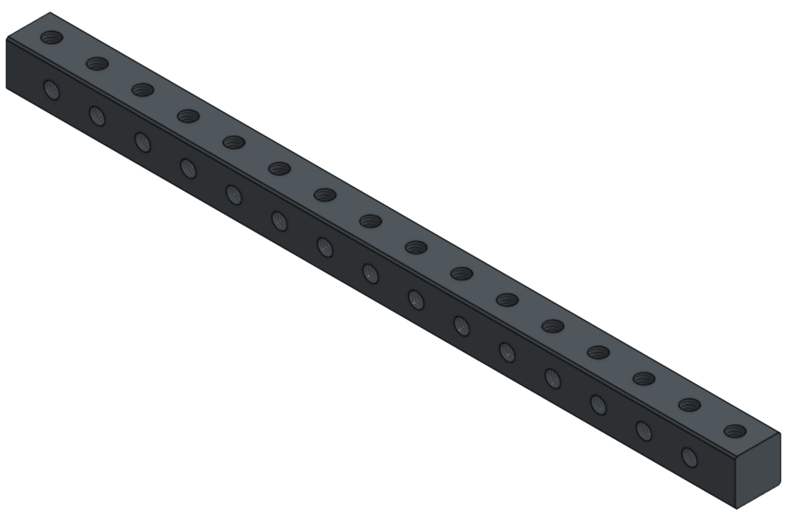

# 👋 欢迎！

欢迎来到 NICE Robotics 官方产品文档，感谢您信任并选择我们的产品！  

NICE Robotics 由多名 FRC 校友创立于 2025 年，我们的团队成员拥有丰富的竞赛经验和工程背景。我们致力于为 FRC 队伍提供基于实战经验、经过验证的可靠零件和完整系统，帮助你的队伍更有信心、更高效地构建机器人。

## 🔥 快速索引

- 

    ***

    **齿轮 — NICE-02-01**

    [:octicons-arrow-right-24: 查看详情](transmission/gear.md)

- 

    ***

    **链轮&链条 — NICE-02-02**

    [:octicons-arrow-right-24: 查看详情](transmission/sprocket_chain.md)

- 

    ***

    **轴承&轴 — NICE-04-01 & 02**

    [:octicons-arrow-right-24: 查看详情](hardware/bearing_shaft.md)

- 

    ***

    **方管塞 — NICE-04-08**

    [:octicons-arrow-right-24: 查看详情](hardware/tube_plugs.md)

- 

    ***

    **螺母条 — NICE-04-07**

    [:octicons-arrow-right-24: 查看详情](hardware/nut_strips.md)

